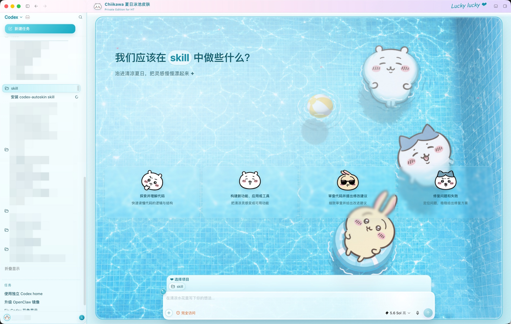

# AutoSkin Codex

**独立的 Codex 桌面皮肤管理 App：从主题制作、多界面预览到安全安装与恢复。**

[](#30-秒开始)
[](#可选skill-适配层)
[](#支持的平台与依赖)
[](#支持的平台与依赖)
[](https://github.com/Jiaranbb)

[English](README.en.md) · [30 秒开始](#30-秒开始) · [效果预览](#效果预览) ·
[直接这样用](#直接这样用) · [FAQ](#faq) ·
[问题反馈](https://github.com/Jiaranbb/autoskin-codex/issues)

发布者：[Jiaranbb](https://github.com/Jiaranbb)

AutoSkin Codex 是一个独立的 macOS 菜单栏 App，负责安装、切换、暂停、恢复和验证 Codex
桌面皮肤。项目基于
[`Finderchangchang/codex-autoskin`](https://github.com/Finderchangchang/codex-autoskin)
的安全换肤思路进行了重构和优化：重新设计主题 schema、预览器和安装流程，把图片素材、
语义配置、生成文件与本地运行时分开管理。

仓库中的 `skill/` 现在是可选的 Agent 适配层和跨平台工具箱，不再承担产品身份。App Bundle
内置经过验证的本地运行时与 Chiikawa Summer 示例，因此日常安装和控制不依赖 skill。

AutoSkin Codex 对实际界面中的多个部位提供深度个性化订制。顶部 Banner、标题栏、侧栏、
建议卡片、输入框、图标、文案、裁切和透明度都可以分别调整，并由 Agent 协助完成主题制作
与反复细化，减少手写大段 CSS、粘贴 Base64 图片以及反复安装试错带来的返工。

> 不只换一张背景图：先分别预览每个界面，再把确认过的皮肤安全安装到真实 Codex。

仓库随附一套完整的 **Chiikawa 夏日泳池主题**。本项目适合对 Codex 自定义皮肤有更深度
个性化订制需求的用户，也适合喜爱 Chiikawa 三小只、想直接使用夏日泳池主题的宝宝们。
你既可以从内置示例直接开始，也可以让 Codex 根据自己的图片生成新的主题、预览图和可安装包。

公开包只附带这一套可编辑示例，不再捆绑上游项目的极光夜空与暖光花瓣演示主题。安全运行时、
主题生成器和安装流程仍完整保留；克隆示例或生成自己的主题后，会安装到独立且可持续保留的
`themes-private/` 目录。

## 效果预览



上图来自 AutoSkin Codex 实际安装效果，不是单独制作的界面设计稿。侧栏中的私人任务名称
已经处理，不代表仓库附带的数据。

### Chiikawa Fan Art 声明

内置示例包含基于 Chiikawa IP 创作的非官方、非商业 Fan Art。相关角色名称、形象及知识产权
归原作者 Nagano 与相应官方权利方所有。

示例插画由用户独立创作并授权收录，并非从官方商品、网站、动画或应用中提取的官方素材。
本项目与 Chiikawa、Nagano 及相关权利方不存在隶属、合作或认可关系，也不表示获得官方
授权。Fan Art 素材仅供个人、非商业的界面定制与分享，请勿用于销售、付费分发或其他商业
用途。完整说明见
[`skill/examples/chiikawa-summer/ASSET-NOTICE.md`](skill/examples/chiikawa-summer/ASSET-NOTICE.md)。

## 30 秒开始

### 推荐：安装独立 macOS App

```bash
bash scripts/build-macos-app.sh
bash scripts/install-macos-app.sh
open "$HOME/Applications/AutoSkin.app"
```

第一次打开后无需运行初始化命令：App 会自动检测 Codex、运行时版本和已安装主题，缺失时自动
安装并 apply。右上角菜单栏的调色盘图标会动态列出全部已安装主题，可直接切换主题与布局；
状态行同时显示 DOM 适配置信度。App 不修改、不替换、不重签名官方 Codex／ChatGPT App。

Codex GUI 更新后，运行时会重新扫描可见 DOM，并根据语义角色、可访问性属性、几何关系和多组
兼容信号重新标记侧栏、主界面、建议卡与输入框。核心样式只依赖 AutoSkin 自己生成的稳定标记，
不依赖 Codex 的构建期 class 名；置信度不足时进入 `stale` 并自动恢复，不会静默套错界面。

### 可选：Skill 适配层

需要用自然语言制作和反复调整自己的主题时，可以额外安装 `skill/`。它调用同一套 App
运行时，不是皮肤生效的必要条件。

把下面这段话发给 Codex：

```text
请从这个仓库安装 AutoSkin.app，并使用可选的 autoskin-codex Skill 制作主题。
安装后先运行 doctor，不要修改或替换官方 Codex App。克隆内置的 Chiikawa Summer
示例并生成预览，等我确认预览后再安装和应用主题。完成后验证首页、新建对话、侧栏、
输入框和重启后的显示状态。
```

安装完成后，在下一条任务中直接说：

```text
使用 autoskin-codex，把内置的 Chiikawa 夏日泳池主题预览给我看；确认后再安装。
```

### 使用 Codex 自带的 Skill 安装器

```bash
python3 ~/.codex/skills/.system/skill-installer/scripts/install-skill-from-github.py \
  --repo Jiaranbb/autoskin-codex \
  --path skill \
  --name autoskin-codex
```

安装后重新打开一个 Codex 任务，让新 Skill 被重新发现。如果本机已经存在同名目录，不要直接
删除正在使用的主题；让 Codex 先检查运行时和私人主题目录，再执行保留主题的升级。

### 手动安装兜底

```bash
git clone https://github.com/Jiaranbb/autoskin-codex.git /tmp/autoskin-codex
mkdir -p ~/.codex/skills
cp -R /tmp/autoskin-codex/skill ~/.codex/skills/autoskin-codex
```

手动安装只复制 Skill，不会自动应用皮肤。安装完成后重新打开一个 Codex 任务，再让
`autoskin-codex` 执行预览、运行时检查和主题安装。

## 可以深度定制哪些部位

AutoSkin Codex 不把皮肤当作一张铺满窗口的背景图，而是把主要界面拆成可以分别调整的区域：

| 可定制区域 | 可以调整的内容 |
|---|---|
| Codex 官方基础主题 | 浅色／深色外观、强调色、基础背景色、前景文字色、对比度和窗口透明策略 |
| 全屏首页背景 | 背景图片、缩放方式、主体焦点、透明度、遮罩颜色与遮罩方向 |
| 顶部 Banner | 独立背景裁切、缩放、焦点、透明度与渐变遮罩，不与全屏背景共用一套参数 |
| 新建对话背景 | 独立图片或复用主图，并单独控制裁切、焦点、淡化程度和背景遮罩 |
| 顶部主题栏 | 品牌图标、主题主标题、短名称、副标题、右侧签名、背景色、文字色和分隔线 |
| 左侧栏 | 背景色、文字色、当前项目选中色和「新建任务」按钮主题色 |
| 首页建议卡片 | 四张卡片各自的图片图标，以及卡片底色、透明度、磨玻璃强度、圆角、阴影、标题色和副标题色 |
| 底部输入框 | 输入框底色、透明度、模糊强度、圆角、阴影、外围背景、文字色和占位文案 |

这些区域使用独立配置。调整卡片透明度不会连带抹掉输入框阴影；修改新建对话的背景淡化程度，
也不会改变全屏首页的主体位置。需要超出 schema 的特殊细节时，才使用经过限制和审查的局部
CSS，而不是重新维护一整份手写皮肤。

## 直接这样用

### 使用内置示例

```text
使用 autoskin-codex，克隆 Chiikawa Summer 示例，生成全屏、Banner 和新建对话预览。
先把预览发给我，暂时不要安装。
```

### 用自己的图片做主题

```text
使用 autoskin-codex，把这张图片做成清爽的浅色 Codex 主题。保留图片右侧主体，左侧留给
标题和卡片；先生成三个界面和三种窗口宽度的预览，不要直接安装。
```

### 修改现有主题

```text
使用 autoskin-codex 调整当前主题：保留背景图，只提高卡片透明度，修复窄窗口下的裁切。
请比较修改前后预览，其他组件不要改变。
```

### 修复 App 更新后的皮肤

```text
使用 autoskin-codex 检查 Codex 更新后皮肤失效的问题。先运行 doctor、status 和 verify，
保留已安装的私人主题和官方主题设置，只修复兼容层。
```

## 适合／不适合

### 适合

- 想把照片、插画、Fan Art 或品牌视觉做成个人 Codex 主题。
- 希望先确认真实窗口预览，再决定是否安装。
- 需要反复调整裁切、透明度、卡片和输入框，而不想维护大段 CSS。
- 希望 Codex App 更新后能够检查、修复并保留私人主题。
- 希望在多套主题之间切换，或随时暂停并恢复官方界面。

### 不适合

- 需要修改、重签名或重新打包官方 Codex App。
- 希望把任意网页 CSS、远程图片或未经审查的脚本直接注入 Codex。
- 要求所有未来 Codex 版本都无需兼容性检查即可永久工作。
- 要把无权公开分发的第三方素材打包成商业主题。

## 常见使用场景

1. 从一张背景图生成第一版主题，并自动建立素材目录和语义配置。
2. 针对全屏、Banner、新建对话分别调整焦点和透明度。
3. 把卡片图标、品牌图标处理成透明背景素材。
4. 对比预览图和真实安装效果，定位选择器、裁切或官方配色差异。
5. 在 Codex 更新后重新验证运行时，不覆盖私人主题。
6. 将完成的主题打包为可复现 ZIP，供家人或朋友安装。

## 支持的平台与依赖

| 平台 | 当前状态 | 基础要求 |
|---|---|---|
| macOS | 已执行本地安装、切换、恢复和卸载回归测试 | Codex 或 ChatGPT 桌面 App、Python 3.9+；通常复用 App 自带 Node.js |
| Windows | 已包含 PowerShell 安装、启动、验证和恢复脚本，公开发布前仍需 Windows 真机复测 | Codex 桌面 App、PowerShell、可用的 Node.js |

macOS 不要求安装 Homebrew 或 SwiftBar。原生菜单栏控制器属于可选功能；只有在需要构建它时
才需要系统可用的 Swift 编译工具。

浏览器预览需要本机可用的 Chromium 系浏览器。若无法自动截图，仍可打开交互式本地预览。

## 首次使用与配置

首次使用建议让 Agent 按以下顺序执行：

1. 检查操作系统、Codex App、Python、Node.js 和本地端口。
2. 验证主题 schema、图片路径和安全规则。
3. 生成全屏、Banner、新建对话以及窄窗口预览。
4. 展示预览并等待用户确认。
5. 记录当前官方主题和运行时状态。
6. 安装本地运行时，但不修改、替换或重签名官方 App。
7. 安装并应用主题。
8. 验证首页、输入框、侧栏、关键按钮和窗口重启后的状态。
9. 若任一步失败，恢复安装前快照并报告失败环节。

主题与运行时默认保存在包体外：

```text
~/Library/Application Support/CodexAutoSkin/
├── runtime/
└── themes-private/

~/Library/Application Support/AutoSkinCodex/
└── snapshots/
```

`CodexAutoSkin` 由 AutoSkin App 首次启动时自动创建。若检测到旧的 `CodexDreamSkin` 状态，
只复制 AutoSkin 使用的运行时、主题和状态文件；旧目录会完整保留，避免影响其他引擎。

因此升级 Skill 时不应删除 `themes-private/`。不要用删除整个运行时目录的方式更新主题。

## 输出与交付物

根据任务不同，AutoSkin Codex 会生成：

- 包含 `theme.json` 和 `assets/` 的可编辑主题源目录。
- 可交互的本地预览页面。
- 全屏、Banner、新建对话及不同窗口尺寸的预览截图。
- 可重新生成的 `.build/<theme-id>/` 运行时文件。
- 确定性主题 ZIP。
- 安装前状态快照与验证结果。

`.build/` 是可丢弃构建产物。需要修改主题时，应编辑 `theme.json` 或原始素材，再重新构建，
不要反向修改生成的 CSS。

## 开发者与 Agent 使用

```bash
cd ~/.codex/skills/autoskin-codex

# 从图片初始化主题
python3 scripts/theme_tool.py init my-theme \
  --image /absolute/path/background.png \
  --output /absolute/path/my-theme

# 或克隆完整示例
python3 scripts/theme_tool.py clone-example \
  --output /absolute/path/chiikawa-summer

# 验证、预览和打包
python3 scripts/theme_tool.py validate /absolute/path/my-theme
python3 scripts/theme_tool.py preview-matrix /absolute/path/my-theme --open
python3 scripts/theme_tool.py package /absolute/path/my-theme \
  --output /absolute/path/my-theme.zip
```

macOS 应用前先检查运行时：

```bash
bash scripts/autoskin-macos.sh doctor
bash scripts/autoskin-macos.sh install --no-start
python3 scripts/install_theme.py /absolute/path/my-theme --apply
bash scripts/autoskin-macos.sh verify
```

真实 Codex UI 回归（不会发送消息或修改会话）可在任一当前页面运行：

```bash
node scripts/live-ui-audit.mjs --port 9335
```

审计会临时覆盖 `1708×977`、`1180×820`、`900×760`、`720×700` 四种视口，
分别验证 fullscreen/banner 布局，并在结束后恢复原布局和窗口状态。发布前应至少在 Work 首页、
Chat 首页、一个有内容的会话、Settings、Plugins、Sites 和 Scheduled 各运行一次。

完整 schema、预览验收和运行时说明见：

- [`skill/references/theme-schema.md`](skill/references/theme-schema.md)
- [`skill/references/authoring-and-qa.md`](skill/references/authoring-and-qa.md)
- [`skill/references/runtime-install.md`](skill/references/runtime-install.md)
- [`skill/references/provenance.md`](skill/references/provenance.md)

## 隐私与安全边界

- 不修改、不替换、不重签名官方 Codex／ChatGPT App，也不修改 `app.asar`。
- 运行时只通过本机回环地址连接 Codex 的 Chromium 调试端口。
- 不需要上传聊天记录；快照不保存用户对话。
- 拒绝远程图片 URL、`data:` 图片、Base64 手写素材、目录穿越和未限定作用域的自定义 CSS。
- 安装主题前保存当前主题与官方配色状态；失败时应恢复快照。
- 应用或修复皮肤时可能需要重启 Codex，Agent 应提前说明。
- macOS 默认可以安装 LaunchAgent 负责皮肤恢复；不需要时使用 `--no-auto-recover`。
- 用户素材是否可以公开或商业使用，由素材作者和相应权利规则决定。仓库代码许可不自动覆盖
  Fan Art 或其他第三方 IP 素材。

## 已知限制与质量提醒

- Codex 桌面 App 的 DOM 和窗口结构可能随更新改变；更新后应重新运行 `doctor` 和 `verify`。
- 预览器可以提前暴露多数布局问题，但真实字体、系统缩放和新版界面仍可能产生细微差异。
- 全屏、Banner 和新建对话使用不同的裁切与透明度；一张预览不能代表所有界面。
- Windows 脚本在公开发布前仍需要真机复测，因此当前不应把 Windows 标记为与 macOS 同等验证。
- 角色图、透明徽章和低对比度背景需要人工视觉确认，自动验证不能代替最终审美判断。

## FAQ

**官方 Codex 主题设置不能完成这些效果吗？**

官方设置适合修改强调色、背景色、前景色和字体等基础属性。整张背景图、独立界面裁切、
磨玻璃卡片、品牌图标和局部装饰仍需要本地主题运行时。AutoSkin Codex 会优先使用官方设置，
只补充官方设置无法表达的部分。

**它会修改或破解 Codex App 吗？**

不会。运行时不替换、不签名、不重新打包官方 App，而是通过本机 Chromium 调试连接作用于
正在运行的主界面。

**必须安装 Homebrew、SwiftBar 或额外 Node.js 吗？**

macOS 通常可以复用 Codex App 自带的 Node.js，因此不要求 Homebrew 或 SwiftBar。Python 3.9+
仍用于主题生成与校验。Windows 当前需要系统能够找到 Node.js。

**为什么要先预览，不能直接安装吗？**

同一张图片在全屏、Banner、新建对话和窄窗口中的裁切不同。先预览可以在影响真实 Codex 前
发现角色被遮挡、背景焦点错误、文字溢出和透明度不合适等问题。

**Codex 更新后皮肤消失了怎么办？**

不要重新制作主题，也不要删除私人主题目录。运行 `doctor`、`status` 和 `verify`，让 Agent
判断是运行时未启动、选择器变化还是官方主题状态变化，再只修复兼容层。

**为什么新建对话页面和项目首页显示不同？**

它们是不同界面状态，使用独立的背景透明度和布局选择器。应分别生成预览并分别验证；若某一
页面在更新后失效，优先修复该界面的适配，不要通过全局 CSS 强行覆盖。

**有菜单栏里的 Skin ON 切换吗？**

macOS 可以构建可选的原生 Swift 菜单栏控制器，用来查看状态、切换主题、暂停和恢复皮肤。
它只是同一运行时的控制入口，不是主题生效的必要条件，也不依赖 SwiftBar。

**怎样暂停皮肤或彻底恢复官方界面？**

`bash scripts/autoskin-macos.sh restore` 会移除当前实时注入，但保留已安装运行时；如需彻底卸载
运行时并恢复安装前的官方配色，再执行 `bash scripts/autoskin-macos.sh uninstall --yes`。卸载前应
确认私人主题是否需要另行保留。

**可以把自己的图片放进去吗？**

可以。让 AutoSkin Codex 从图片初始化新主题，并说明要保留的主体位置、预期布局、卡片透明度
和颜色偏好。首次生成后仍应查看完整预览矩阵。

**内置 Chiikawa 图片是官方素材吗？**

不是。它们是独立创作并经用户授权收录的非官方、非商业 Fan Art。相关角色与 IP 权利归原作
者及相应官方权利方所有，素材不属于代码 MIT 许可范围。

**怎样更新 Skill 又不丢失当前主题？**

不要直接覆盖运行时或删除 `themes-private/`。让 Codex 使用保留主题的迁移流程更新 Skill 与
运行时来源，并在更新后检查当前主题、暂停状态、LaunchAgent 和官方配色。

## 相关项目

- [ecommerce-helper](https://github.com/Jiaranbb/ecommerce-helper) — 从新品研究、人民币定价到商详与社媒内容的完整电商素材包 Skill；
- [report-helper](https://github.com/Jiaranbb/report-helper) — 一句话启动长篇深度研究，并生成带来源的报告与 PDF；
- [content-reader](https://github.com/Jiaranbb/content-reader) — 保存小红书、Twitter／X、YouTube 和 B 站内容的组合型 Agent Skills；
- [xhs-reader](https://github.com/Jiaranbb/xhs-reader) — 免登录保存小红书笔记到本地；
- [pdf-reader](https://github.com/Jiaranbb/pdf-reader) — 将 PDF 转换成带页码与质量指标的 Markdown；
- [dreamy-photo](https://github.com/Jiaranbb/dreamy-photo) — 保留真实主体细节的梦幻化照片编辑 Skill；
- [jiucai-helper](https://github.com/Jiaranbb/jiucai-helper) — 将投资方法和纪律整理成可验证的个人投资决策 Skill。

更多原创项目见 [Jiaranbb 的 GitHub 主页](https://github.com/Jiaranbb?tab=repositories)。

## 关于作者

**嘉然 Jiaran（Jiaranbb）** — 独立开发者／AI Builder

持续把自己真正需要的工作流做成可复用的 AI 工具与 Skills。

- 个人网站：[c.aoao.ai](https://c.aoao.ai)
- GitHub：[github.com/Jiaranbb](https://github.com/Jiaranbb)
- X／Twitter：[@_jiaran](https://x.com/_jiaran)
- 微信：`evadebot`
- 公众号：**嘉然学习笔记**
- 支持与反馈：[SUPPORT.md](SUPPORT.md)
- 项目问题：[GitHub Issues](https://github.com/Jiaranbb/autoskin-codex/issues)

## License

代码部分采用 [`MIT License`](LICENSE)。

Chiikawa Summer 示例中的 Fan Art 素材不适用代码 MIT License，仅允许个人、非商业的主题
定制与分享；详细范围见
[`skill/examples/chiikawa-summer/ASSET-NOTICE.md`](skill/examples/chiikawa-summer/ASSET-NOTICE.md)。

本项目的运行时实现来源于并改造自
[`Finderchangchang/codex-autoskin`](https://github.com/Finderchangchang/codex-autoskin)，保留其
MIT 许可与原始版权声明。
